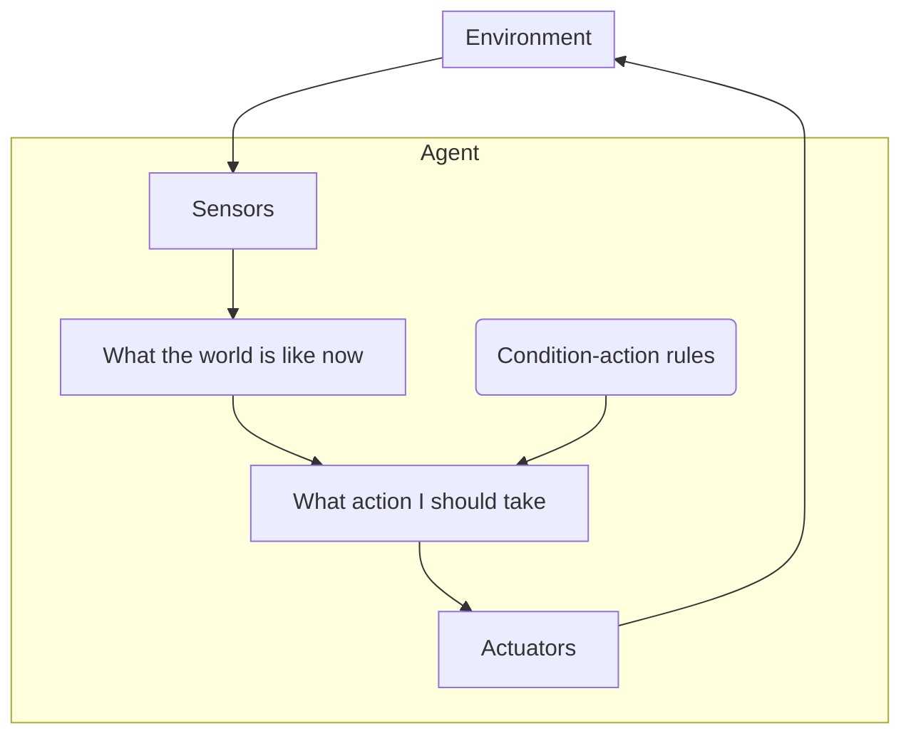
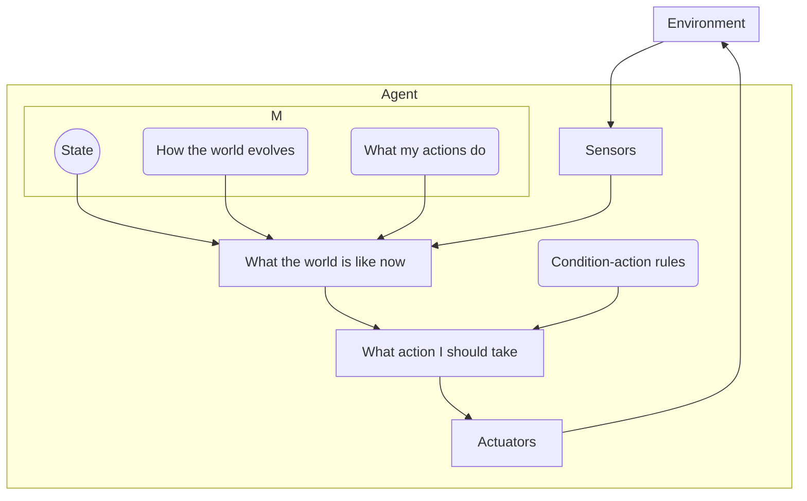

# Unit Summary
Tags: #Summary #UAG

Relevant files: [[Computer Science/Introduction to AI/0 Lectures/Lecture 1.pdf|Lecture 1]], [[Computer Science/Introduction to AI/0 Lectures/Lecture 2.pdf|Lecture 2]], [[Computer Science/Introduction to AI/0 Lectures/Lecture 3.pdf|Lecture 3]]

# A Quest for Artificial Intelligence
# Intelligent Agents
## Environment Types
The environment of a rational agent can be largely described by the following properties
1. Observable: Can the entire environment be seen or known about?
2. Agent number: Are there more than one agents here?
3. Deterministic: Every outcome follows a decision
4. Episodic: Things don't have history
5. Static: Doesn't change behind your back
6. Discrete: State, time, and perceptions are all discrete
7. Known: Does the agent know all of the rules

Pretty much any system falls under these seven different categories and each one helps you determine what you need to take into account within the agent.

## Agent Architectures
There are a few different agent architectures we will be using in this particular class. Each of which has an increasing level of complexity because of the amount that they model themselves and the world around them
#### Simple Reflex Agent
This one works by a set of conditions

#### Model-based Reflex Agent
Uses an internal state to keep track of the world

#### Goal-based Reflex Agent
Has a world model and a goal to guide action selection
#### Utility-based Reflex Agent
Has a world model, and a utility function to select preferred locations