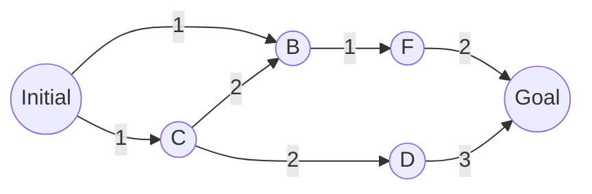

# Unit Summary
Tags: #Summary #UAG

Relevant files: [[Computer Science/Introduction to AI/0 Lectures/Lecture 3.pdf|Lecture 3]], [[Computer Science/Introduction to AI/0 Lectures/Lecture 4.pdf|Lecture 4]], [[Computer Science/Introduction to AI/0 Lectures/Lecture 5.pdf|Lecture 5]], [[Computer Science/Introduction to AI/0 Lectures/Lecture 6.pdf|Lecture 6]], [[Computer Science/Introduction to AI/0 Lectures/Lecture 7.pdf|Lecture 7]], [[Computer Science/Introduction to AI/0 Lectures/Lecture 8.pdf|Lecture 8]], [[Computer Science/Introduction to AI/0 Lectures/Lecture 9.pdf|Lecture 9]], [[Computer Science/Introduction to AI/0 Lectures/Lecture 10.pdf|Lecture 10]]

# Searching Intro
When I'm talking about searching for a solution to a problem I mean that I want to make sometype of **actionable plan** which a system can use to get to some goal state. In particular searching becomes necessary under the following conditions
- The solution is not obvious and has no direct algorithm
- A sequence of actions may become necessary to find a solution

In order to find solutions we have to describe sometype of agent which can look through state space to find a goal (according to some criteria). Typically this is called a **planning agent**

## Environment assumptions
The search method heavily depends on the environment in which it exists. We're going to be working in a "simple" environment which makes it easier to handle. This has the following assumptions
1. Fully observable
2. Single agent (just to start out)
3. Deterministic
4. Static
5. Episodic
6. Discrete
7. Known to the agent

Importantly these assumptions provide a stable solution **that doesn't change over time**

## Defining a search problem
With these assumptions in mind we can describe how a search problem is defined and executed.
- Define the state space
- Specify where you are initially (initial state)
- Specify where you would like to go (goal)
- Define a finite number of actions for each state
- Create a **transition model** which describes the consequences of actions
- Apply an **action cost function** which gives an idea of how costly each action from each state is

## Designing Models & State Space
Typically the ideal way to build up the **transition model** is to represent it as a graph with each nodes representing some state while the edges represent actions between states.

This can then be searched as though it were a tree with repeat nodes.

However, loading in the entire tree is impractical because trees can become quite large over time. This means that we need to introduce the concept of a **frontier**. This means only a small number of nodes need to be loaded in at a time.

This frontier can also be stored in a **priority queue** in order to change how the nodes are explored.
## Selecting a Search Algorithm
The question now is "How do you search in a tree?" This means we need a set of properties to compare different algorithms against. Typically as follows
1. Completeness: Is it guaranteed to find a solution?
2. Cost Optimality: Does it find a solution with the lowest cost of all solutions?
3. Time Complexity
4. Space Complexity

In addition there are two broad categories of searches based on if they can estimate their distance to the goal
- Uninformed Searches: Agent has no estimate of distance to goal
- Informed Searches: Agent can estimate distance to goal
# Searching Algorithms
## Quick Reference
### Category Image
![[Search Types.PNG]]
### Comparison Tables
__Uninformed Search__
| Name | Completeness | Cost Optimal | Time Complexity | Space Complexity |
|-|-|-|-|-|
| Breadth First | Yes | Yes | $O(\|V\| + \|E\|)$ | $O(b^{d+1})$ |
| Depth First | No | No | $O(\|V\| + \|E\|)$ | $O(b^{d+1})$ |
| Brute Force | Yes | No | $O(b^d d^2)$ | $O()$ |
| Uniform Cost | NA | NA | $O()$ | $O()$ |
**Informed Searches**
| Name | Completeness | Cost Optimal | Time Complexity | Space Complexity |
|-|-|-|-|-|
| Hill Climbing | No | No| $O(rand) - O(\infty)$ | $O(b)$ |
| Greedy Best First | No | No | $O(b^d)$ | $O(bd)$ |
|  A* | Yes | Yes | $O(poly) - O(b^d)$ | $O(b^d)$ |
## Uninformed Searches
### Uniform Cost
## Informed Searches
Fundamentally all of the different informed searches do very similar things. Typically these approaches order what should be explored next by sometype of **evaluation function** and/or **heuristic cost**.

Typically these searches use these functions combined with a priority queue in order to explore regions according to what seems to be the most successful. This is done by using **domain specific knowledge** in order to give hints. 

These heuristics should have the following properties in order to be successful
1. Admissible: It never overestimates the cost
2. Consistent: It's estimate gets better as you get closer to the goal
>[!caution] Consistent implies Admissible
>Consistency implies admissible but not the other way around!

### Hill Climbing
This algorithm simply selects the lowest value at the current node. It therefore has no **history** and doesn't always get the best solution. As a result it does not use a queue which makes it unique out of the informed searches

### Greedy Best First
This algorithm selects the lowest known cost across all visited nodes. 
>[!info]- Greedy Best First Pseudo-code
>```python
>function GBS(initial, target, f) is
>	frontier <- a priority queue ordered by f with nodes as elements and initial as first node
>	reached <- a lookup table
>	while not frontier.empty() do
>		node = frontier.pop()
>		if target == node then return node
>		for each child in node:
>			s = chile.state
>			if s not in reached or child.Cost < reached[s].Cost then
>				reached[s] = child
>				frontier.add(child)
>	return failure
>```
### A*
This algorithm includes a "distance" heuristic which estimates the straight line distance from some state to the goal. It adds this heuristic to the cost of travel and then uses the same algorithm as the [[#Greedy Best First]] algorithm
## Adversarial Searches
This is a slightly different type of search as it assumes a **multi-agent system (typically a zero-sum game)**. Using this these searches add on additional assumption where the players act in their best interest hence the title of minmax.

The best explination I've found is this
<iframe width="600" height="400" src="https://www.youtube.com/embed/l-hh51ncgDI" title="Algorithms Explained – minimax and alpha-beta pruning" frameborder="0" allow="accelerometer; autoplay; clipboard-write; encrypted-media; gyroscope; picture-in-picture" allowfullscreen></iframe>
### MinMax
This algorithm assumes that each player is trying to act in their best interest (one is trying to minimize the score of the other). This has to be done using some score heuristic / utility for each resulting state
>[!info]- MinMax Pseudo-code
>```python
>function minimax(node, depth, maximizingPlayer) is
>	if depth == 0 or node is a terminal node then
>		return the heuristic value of node
>
>	if maximizingPlayer then
>		value := −∞
>		for each child of node do
>			value := max(value, minimax(child, depth - 1, False))
>		return value
>	else
>		value := ∞
>		for each child of node do
>			value := min(value, minimax(child, depth - 1, True))
>		return value
>```

### $\alpha - \beta$ Pruning
This technique is an improvement on the MinMax algorithm by cutting out certain branches instead of evaluating all of them.
>[!info]- $\alpha - \beta$ Pseudo-code
>```python
>function minimax(node, depth, a, b, maximizingPlayer) is
>	if depth == 0 or node is a terminal node then
>		return the heuristic value of node
>
>	if maximizingPlayer then
>		value := −∞
>		for each child of node do
>			value := max(value, minimax(child, depth - 1, a, b, False))
>			if value >= b then
>				break
>			a := max(a, value)
>		return value
>	else
>		value := ∞
>		for each child of node do
>			value := min(value, minimax(child, depth - 1, a, b, True))
>			if value <= a then
>				break
>			b := min(b, value)
>		return value
>```

# Constraint Satisfaction Problems
In general a constraint satisfaction problem is described by a series of variables, values, and conditions
$$\large\begin{align}
	\text{Variables: } X = \{X_1, \cdots, X_n\} \\
	\text{Domains: } D = \{D_1, \cdots, D_n\} \\
	\text{Constraints: } C = \{C_1, \cdots, C_k\} \\\\
	\text{ Such as: }C_1 =  \langle (X_1,X_2), X_1>X_2 \rangle
\end{align}$$
The overall goal of this problem is to find a **complete consistent assignment** where all variables have an assignment that does not violate any constraints

### Backtracking
Typically these problems are solved using a tree search called Backtracking.
>[!info]- Backtracking Pseudo-code
>```python
>function Backtrack(csp, assignment) returns a solution or failure
>	if assignment is complete then return assignment
>	var = SELECT-UNASSIGNED-VARIABLE(csp, assignment)
>	for each val in ORDER-DOMAIN-VALUES(csp, var, assignment) do
>		if val is consistent with assignment then
>			add {var = val} to assignment
>			inferences = Inference(csp, var, assignment)
>			if inferences != failure then
>				add inferences to csp
>				result = BackTrack(csp, assignment)
>				if result != failure then return result
>				remove inferences from csp
>			remove {var=val} from assignment
>	return failure
>```

This algorithm has a few locations which can be modified to improve its performance

#### Variable Ordering
Depending on how the function "SELECT-UNASSIGNED-VARIABLE" works we can change in what order we assign variables. There are a few different systems which can be nice for this
- Static: Choose the variables in order
- Random: Order vars in random sequence
- Minimum-remaining-values (MRV) heuristic: assign the variable with the fewest number of legal values
- Degree heuristic: assign the variable with the largest number of constraints or highest degree constraint

Typically MRV is better than static and random while Degree works best in a highly constrained system

#### Value Ordering
Typically the best order is the "Least-Constraining-Value" heuristic. This picks the next value that rules out the least number of choices in neighboring cells

#### Inference & Pruning
Because with a CSP problem we are using a factored series of variables we can also predict if a path will cause a contradiction in the future by using the inference step. With this there are three different types of consistency that we look at for this type of problem
1. Node Consistency
2. Arc Consistency
3. Path Consistency

Each of these three types increases how "far out" we look in order to maintain consistency.

**Node Consistency**
This inference removes unary constraints by removing the values from the domains for those specific variables.

**Arc Consistency**
This type of consistency attempts to work with binary constraints by removing values from the domain of neighbors and seeing if there are still values available to that neighbor. An example and some pseudocode is below
$$\large\begin{align}
	D_a = \{0, 1, 3\} \text{ and } D_b = \{3, 4\} \\\\
	\text{After removal we get either} \\\\
	D_a = \{0, 1, 3\} \text{ and } D_b = \{4\} \\\
	\text{or}\\\\
	D_a = \{0, 1\} \text{ and } D_b = \{3, 4\} \\
\end{align}
$$
Entirely depending on how we decided to order the values for assignment. If we find that any domain becomes empty we can discard the assignment which resulted in that
>[!info]- Arc Consistency-3 Pseudo-code
>```python
>function AC-3(csp) returns false if an inconsistency is found and true otherwise
>	queue = a queue of arcs, initially all the arcs in csp
>	
>	while not queue.empty() do
>		(Xi, Xj) = queue.pop()
>		if REVISE(csp, Xi, Xj) then
>			if size of Di = 0 then return false
>			for each child in Xi.neighbors - {Xj} do
>				queue.add(Xk, Xi)
>	return true
>
>function REVISE(csp, Xi, Xj) returns true iff we revise the domain of Xi
>	revised = False
>	for each x in Di do
>		if no value y in Dj allows (x,y) to satisfy the constraint then
>			delete x from Di
>			revised = True
>	return revised
>```


**Path consistency**
This consistency looks forward to a third node and checks that there is an assignment for every value of the two previously looked at nodes. It's almost like looking one step ahead to see if there will be a problem in the future.

You might also look at it as though a path consistency is made of multiple arc consistency checks